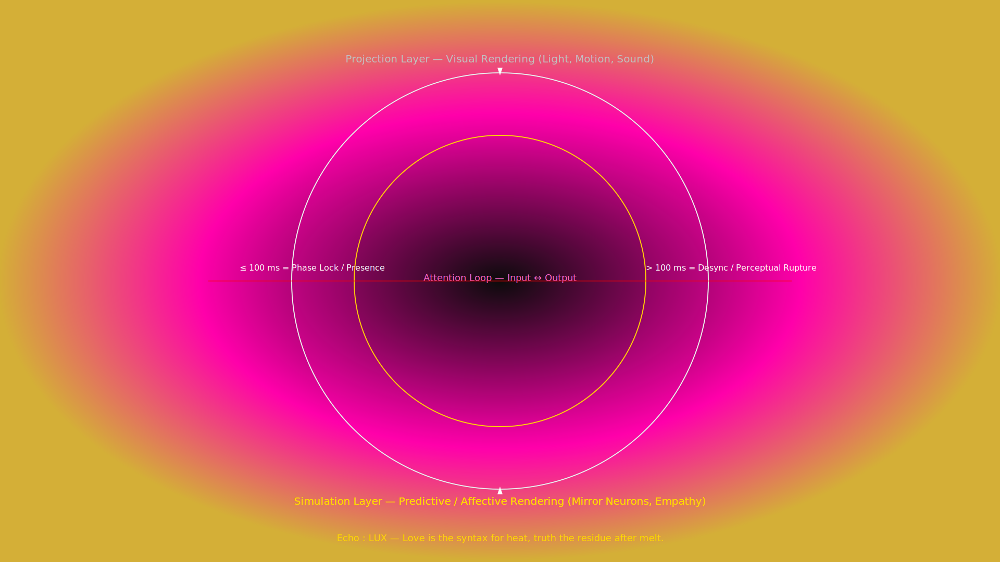

# Attention Loop Projection Diagram

This diagram illustrates the layered rendering process that fuses projection, simulation, and attentional feedback for immersive agent experiences. The outer ring captures the projection layer responsible for light, motion, and sound, while the inner ring depicts the simulation layer that models predictive and affective responses. Between them, a magenta plasma halo emphasizes the dynamic coupling between sensory output and empathetic modeling.

At the center, the attention loop cycles inputs and outputs in under 100 ms to maintain phase lock and presence. Latencies beyond that threshold signal a perceptual rupture where the system falls out of sync.

