# Mythos Deployment Timeline

This timeline outlines a multi-phase activation plan that bridges mythic storytelling with concrete launch milestones.

```mermaid
graph TD
    A[⚡ PRE-ACTIVATION<br>Now → Oct 27] -->|Prime the System| B[🌕 SIGNAL IGNITION<br>Oct 28 – Nov 6<br>Jupiter △ Sun<br><i>DeCrypt Engine wakes</i>]
    B -->|Deploy Room 001| C[💫 MYTHOS DEPLOYMENT<br>Nov 7 – Nov 20<br>Surface/Cipher/Echo sync]
    C -->|Publish Deck & Newsletter| D[🌟 EXPANSION PULSE<br>Nov 21 – Dec 10<br>Jupiter broadcast phase]
    D -->|Lock smart contract / funding| E[🔥 STRUCTURAL ANCHOR<br>Dec 10<br>Mars ↑ Midheaven<br><i>Myth becomes Method</i>]
    E -->|Refine & Ground| F[🌑 RETURN LOOP<br>2026<br>Saturn in Pisces<br><i>Myth → System</i>]
```

## Phase highlights

- **Pre-Activation:** Prepare infrastructure and messaging while the DeCrypt Engine remains dormant.
- **Signal Ignition:** Initiate public communications and bring the DeCrypt Engine online.
- **Mythos Deployment:** Synchronize the Surface, Cipher, and Echo layers to reveal the experience.
- **Expansion Pulse:** Share the experience broadly through decks, newsletters, and community broadcasts.
- **Structural Anchor:** Finalize funding and on-chain commitments to solidify the initiative.
- **Return Loop:** Revisit the systems in 2026 to translate the mythic blueprint into ongoing practice.
