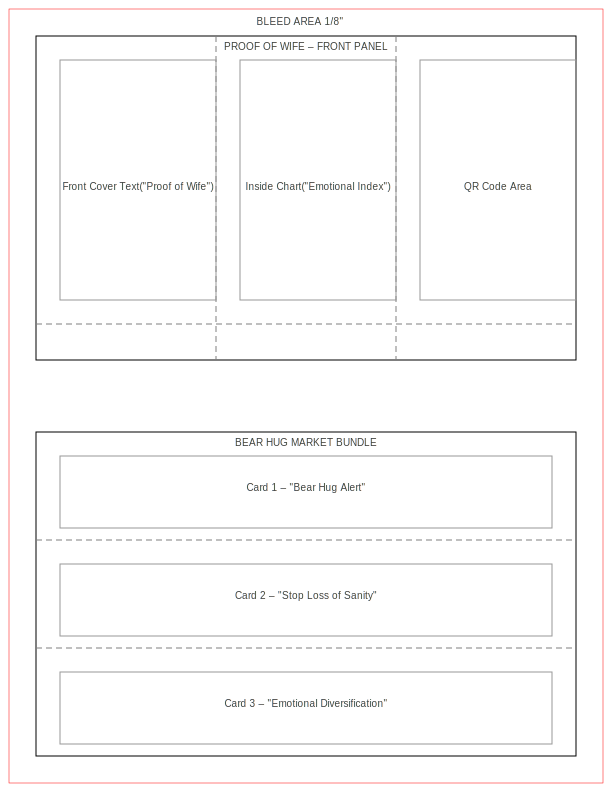

# Proof of Wife – Cold Wallet Christmas Card Layout

This reference layout captures the production notes for the “Proof of Wife” cold wallet Christmas card and the companion Bear Hug Market insert set. The artwork is delivered as a print-ready SVG that fits an 8.5" × 11" sheet with a 1/8" bleed. Use it as a starting point for customizing typography, illustrations, or QR codes before exporting a final print file.

## Panel map

The upper half of the sheet contains the trifold Christmas card:

- **Front panel:** The left column reserves space for the “Proof of Wife” title or any cover illustration. The labeled placeholder is 156 × 240 pt inside the safe area.
- **Inside spread:** The center column is intended for the “Emotional Index” chart or other narrative content.
- **Back panel:** The right column highlights a 156 × 240 pt zone for a scannable QR code that links recipients to cold wallet instructions, playlists, or landing pages.
- **Bottom flap:** A horizontal dashed fold line at 324 pt from the top marks the tuck-in flap for gift card pockets or handwritten notes.

All vertical dashed lines are fold references; the solid rectangle marks the final trim size once the bleed area is removed.

## Bear Hug Market insert bundle

The lower half of the layout is designed for three detachable mini cards that can accompany the main greeting:

1. **Bear Hug Alert** – great for uplifting trading desk morale.
2. **Stop Loss of Sanity** – a reminder to take breaks during market volatility.
3. **Emotional Diversification** – prompts mindful rebalancing across family, friends, and rest.

Each insert is 492 × 72 pt inside the safe area, separated by dashed cut guides. After printing, trim along the outer solid border, slice the horizontal separators, and optionally score the dashed lines for cleaner tears.

## Printing checklist

- Export the SVG to PDF at 300 DPI for offset or digital printing.
- Retain the bleed boundary to avoid white edges after trimming.
- Replace the placeholder labels with your actual typography before final output.
- Test the QR code at full scale to confirm scan reliability.

The combination of the trifold card and the three inserts makes an easy-to-assemble holiday bundle that keeps cold wallet details organized while leaning into the Bear Hug Market theme.
