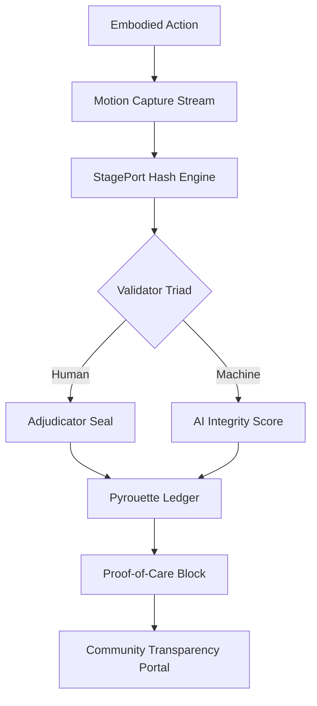
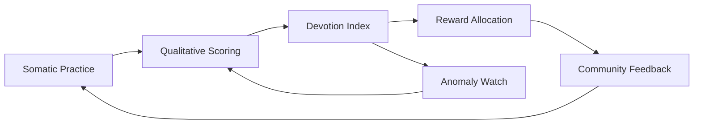

# Grace Fund Constitution – Act II: Lineage as Ledger

*Publication-ready whitepaper prepared for institutional review and investor distribution.*

## Executive Abstract

- **Mission:** Translate inherited cultural legitimacy into programmable ethics where every act of care produces verifiable capital.
- **Infrastructure:** Combine archival governance, embodied verification, and distributed mentorship into a resilient ledger stack that privileges proof-of-care over proof-of-work.
- **Deployment:** Leverage StagePort™ and Pyrouette™ adjudication layers to synchronize human and machine validators, ensuring that artistic, civic, and financial flows maintain ethical fidelity across networks.
- **Outcome:** Deliver a repeatable protocol in which inheritance becomes a continuous verification cycle—producing transparent, investable impact backed by cryptographic accountability and kinesthetic consensus.

## Table of Contents

1. Historical Proof vs. Operational Translation
2. Governance Protocols: Proof-of-Legitimacy by Care
3. Cross-Ledger Consensus Architecture
4. Custodial Tokenomics and Mentorship Equity
5. Kinesthetic Consensus Layer
6. Protocol Init Function: Code of Grace
7. Architectural Stack and Entropy Stewardship
8. Implementation Roadmap & Investor Readiness

## 1. Historical Proof vs. Operational Translation

| Historical Proof | Operational Translation |
| --- | --- |
| **House of Savoy (1703)** – Marchese di Rovagnasca codified administrative sovereignty through sealed correspondence and transnational verification rituals, making the archive an early trust ledger. | **Governance Protocol** – Grace Fund replaces inherited paper sovereignty with cryptographic ethics. Each transaction—artistic, financial, or relational—is notarized by distributed trust primitives that prioritize care over lineage. |
| **Bohemia Filament (1758–1848)** – Dual-jurisdiction officers of the Habsburg frontier synchronized authority through seals and cross-signature, pioneering multi-ledger verification. | **Cross-Ledger Consensus** – StagePort™ and Pyrouette™ extend multi-ledger logic into embodied computing. Human adjudicators mirror machine verifiers, and every motion produces a timestamped ethical hash. |
| **Van Cura Continuation (1927–present)** – Civic transmission through disciplined ballet pedagogy preserved legal principles via embodied grace. | **Proof of Custody** – Training and mentorship function as public goods. Each mentor operates as a validator node within the Grace Fund’s governance lattice. |
| **Dutchess Ballet Company (1980s–2000s)** – Valerie Feit’s studio network embedded classical rigor in regional ecosystems, generating intergenerational continuity. | **Custodial Tokenomics** – Artistic labor accrues ledger equity. Royalties route through community smart contracts aligned with Athletes of AlgoRhythm™ faculty structures. |
| **Limón–Taylor–Kaddar Line (21st century)** – Modernist choreography encodes kinetic ethics where balance, breath, and control document moral law. | **Kinesthetic Consensus** – StagePort’s AI evaluation layer renders physical grace as measurable integrity; devotion becomes data, ensuring transmission fidelity. |

*The table establishes the dual-column schema guiding the remainder of the whitepaper.*

## 2. Governance Protocols: Proof-of-Legitimacy by Care

### 2.1 Archival Sovereignty as Precedent

- Archival seals from the House of Savoy show how legitimacy was historically notarized through ritualized documentation. The Grace Fund abstracts this into a **Proof-of-Legitimacy by Care** protocol that weights validation rights by demonstrated custodial stewardship.
- Investor assurance derives from verifiable care records—mentorship hours, rehearsal logs, and community service—rather than inherited title.

### 2.2 Compliance Layer

- **Identity Oracles:** Cross-reference human biographies with on-chain attestations to prevent privilege laundering.
- **Ethical Service Level Objectives (eSLOs):** Quarterly thresholds for community impact, mutual aid contributions, and restorative justice interventions trigger automatic audits and rebalancing.

### 2.3 Risk Controls

- Replace punitive clawbacks with **Care Covenants** that redirect non-compliant capital into mutual aid vaults until validators restore alignment.

## 3. Cross-Ledger Consensus Architecture

### 3.1 StagePort™ × Pyrouette™ Sync

- StagePort’s motion capture transcripts are hashed into Pyrouette’s governance ledger, forming dual verification loops between human adjudicators and machine analytics.
- Each adjudication session generates a multi-signature packet: choreographer, validator, and AI observer.

### 3.2 Ethical Hashing Pipeline

### 3.3 Auditability

- Immutable audit trails expose choreography-to-capital flows for investors without compromising participant privacy; zero-knowledge attestations reveal compliance without exposing raw biometric data.

## 4. Custodial Tokenomics and Mentorship Equity

### 4.1 Validator Roles

- **Mentor Validators:** Receive proportional governance weight per apprentice who achieves defined milestones.
- **Community Trustees:** Oversee royalty pools tied to regional studios, mirroring Valerie Feit’s distributed stewardship model.

### 4.2 Token Design

- **Grace Units (GU):** Non-transferable reputation tokens minted through verified care events.
- **Custody Shares (CS):** Yield-bearing tokens allocated to collective vaults, redeemable for scholarship disbursements and emergency aid.

### 4.3 Revenue Cycling

- Smart contracts deposit performance royalties into local vaults; withdrawal is conditioned on proof-of-care metrics and ongoing mentorship commitments.

## 5. Kinesthetic Consensus Layer

### 5.1 Modernist Lineage as Moral Code

- The Limón–Taylor–Kaddar transmission demonstrates how balance and breath encode ethics. StagePort quantifies this by translating kinetic fidelity into consensus signals.

### 5.2 Kinesthetic Consensus Loop

- The loop ensures that any degradation in embodied ethics triggers anomaly review, protecting investors from cultural drift while preserving artistic autonomy.

## 6. Protocol Init Function: Code of Grace

- The protocol’s init function draws from the *Protocol: System Restore — Somatic Syntax Engine* directive: “Collect — commit only the blocks. Draft — the stack. Vault — the fibers. Control the environment. Funnel perception → aortic flow function.”【F:docs/protocol_system_restore_v2.html†L73-L95】
- Implementation map:
  - **Collect:** Preserve truth by ingesting validated choreographic and financial records into tamper-proof vaults.
  - **Commit:** Execute transparent state changes where every on-chain block equals a verified act of care.
  - **Vault:** Harden heritage assets with layered custodial encryption and consent frameworks.
  - **Flow Function:** Route empathy efficiently—capital unlocks follow physiological and communal readiness rather than arbitrary schedules.

## 7. Architectural Stack and Entropy Stewardship

### 7.1 Ledger Stack Narrative

- **Governance (Root):** Archival legitimacy from Savoy and Bohemia anchors authority.
- **Verification (Branch):** StagePort/Pyrouette tandem enforces distributed ethics.
- **Custody (Lineage):** Mentorship networks form the living state machine.
- **Consensus (Grace):** Kinesthetic fidelity finalizes blocks through devotion-indexed scoring.

### 7.2 Entropy as Transparency

- Entropy, defined in the MWRA glossary as “a non-decreasing state variable … the change of entropy equals the change of heat energy divided by temperature,” frames ethical transparency as conserved energy converted into social light.【F:docs/mwra-glossary-entropy.md†L3-L3】
- The Grace Fund channels artistic heat into traceable impact, ensuring no care input dissipates without recorded benefit.

## 8. Implementation Roadmap & Investor Readiness

1. **Phase I – Validator Cohort Formation:** Identify legacy mentors, archivists, and adjudicators to seed the validator network. Draft care covenants and configure identity oracles.
2. **Phase II – Prototype Deployment:** Launch StagePort × Pyrouette pilot with dual-signature adjudication packets. Begin minting Grace Units for validated care events.
3. **Phase III – Custodial Vault Activation:** Deploy community smart contracts for royalty distribution. Integrate zero-knowledge attestations for privacy-preserving audits.
4. **Phase IV – Governance Scaling:** Introduce cross-border mutual aid liquidity pools and automated compliance dashboards for institutional investors.

### Investor Pack Deliverables

- Executive summary with risk mitigation matrix.
- Compliance attestation logs demonstrating proof-of-care events and validator performance.
- Technical appendix covering kinesthetic consensus algorithms and entropy-based transparency metrics.

*Inheritance becomes ongoing verification; the Grace Fund operationalizes empathy, lineage, and law into a programmable protocol where every gesture leaves a cryptographic imprint.*

